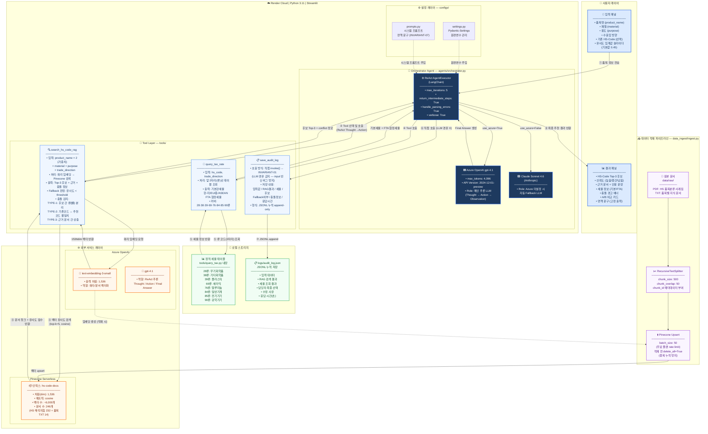

# 시스템 아키텍처 다이어그램

## 전체 시스템 아키텍처



---

## 레이어별 요약

| 레이어 | 구성 요소 | 역할 |
|--------|----------|------|
| **사용자** | Streamlit Web UI | 입력 수집 / 결과 시각화 |
| **Orchestrator** | ReAct AgentExecutor (LangChain) | 도구 호출 순서 결정 · 추론 |
| **LLM** | Azure OpenAI gpt-4.1 / Claude Sonnet 4.6 | 자연어 추론 · 응답 생성 |
| **Tool: RAG** | search_hs_code_rag | Pinecone 검색 + 충돌 감지 |
| **Tool: 세율** | query_tax_rate | 정적 세율 테이블 조회 |
| **Tool: 로그** | save_audit_log | 감사 로그 직접 저장 |
| **벡터 DB** | Pinecone Serverless (1536dim, cosine) | 문서 유사도 검색 |
| **임베딩** | text-embedding-3-small | 쿼리·문서 벡터화 |
| **스토리지** | audit_log.json / 정적 세율 테이블 | 로컬 영구 저장 |
| **배포** | Render Cloud (Python 3.11) | 클라우드 서비스 운영 |

## 핵심 데이터 흐름 (8단계)

```
① 사용자 입력 → Streamlit UI
② Orchestrator ReAct 루프 시작 (Thought → Action)
③ search_hs_code_rag: 쿼리 임베딩 → Pinecone 코사인 검색 → Top-3 + 충돌 감지
④ query_tax_rate: HS 앞 2자리(류)로 세율 테이블 조회
⑤ 세율 정보 반환
⑥ save_audit_log: 직접 invoke() (LLM 미경유)
⑦ JSONL 감사 로그 저장
⑧ Final Answer 생성 → Streamlit 결과 패널 출력
```
