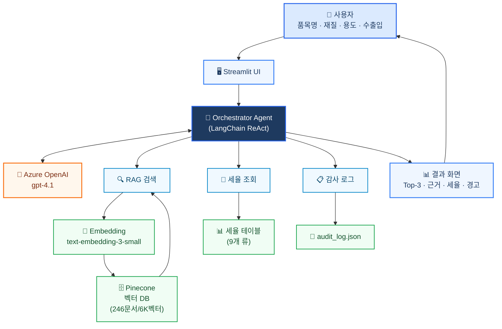

# 시스템 아키텍처 다이어그램 (심플 버전)

## 전체 구조



---

## 한눈에 보는 데이터 흐름

```
사용자 입력
    ↓
Streamlit UI
    ↓
Orchestrator Agent (gpt-4.1)
    ├─→ RAG 검색  → Pinecone (벡터 유사도)
    ├─→ 세율 조회 → 세율 테이블
    └─→ 감사 로그 → audit_log.json
    ↓
결과 화면 (Top-3 + 근거 + 세율)
```

---

## 핵심 구성 요소 (4가지)

| 구성 | 역할 |
|------|------|
| 🤖 **Orchestrator Agent** | 사용자 입력 해석 → 도구 선택·호출 → 응답 생성 |
| 🧠 **LLM (Azure gpt-4.1)** | 자연어 추론 및 최종 답변 작성 |
| 🗄️ **Vector DB (Pinecone)** | 246개 문서를 벡터로 저장, 유사도 검색 |
| 🔧 **Tools (3종)** | RAG 검색 / 세율 조회 / 감사 로그 |
