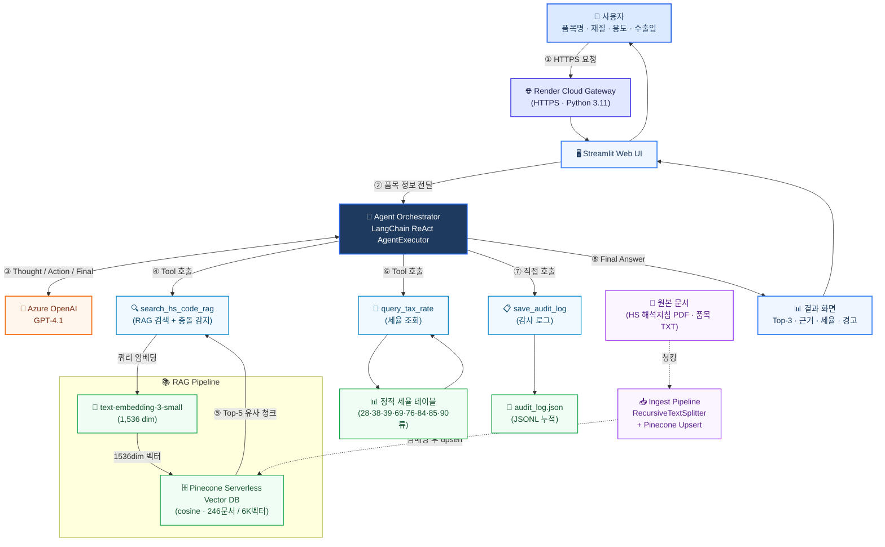

# 시스템 아키텍처 다이어그램 (심플 버전)

## 전체 구조



---

## 한눈에 보는 데이터 흐름

```
사용자
   ↓ HTTPS
Render Cloud Gateway
   ↓
Streamlit Web UI
   ↓
Agent Orchestrator (LangChain ReAct)
   ↕ Azure OpenAI GPT-4.1  (Thought/Action 추론)
   │
   ├─→ search_hs_code_rag
   │     └─→ text-embedding-3-small → Pinecone Vector DB
   │
   ├─→ query_tax_rate
   │     └─→ 정적 세율 테이블 (9개 류)
   │
   └─→ save_audit_log
         └─→ audit_log.json (JSONL)
   ↓
결과 화면 (Top-3 + 근거 + 세율 + 경고)
```

---

## 핵심 컴포넌트 (실제 기술명)

| 컴포넌트 | 기술 스택 | 역할 |
|---------|----------|------|
| **Gateway** | Render Cloud (Python 3.11) | HTTPS 진입점 · 클라우드 호스팅 |
| **UI** | Streamlit | 사용자 입력 / 결과 시각화 |
| **Agent Orchestrator** | LangChain ReAct AgentExecutor | 도구 선택·호출 순서 결정 |
| **LLM** | Azure OpenAI **GPT-4.1** | 자연어 추론 (Thought→Action→Final) |
| **Embedding Model** | Azure **text-embedding-3-small** (1536 dim) | 쿼리·문서 벡터화 |
| **Vector DB** | **Pinecone Serverless** (cosine) | 246문서 / 약 6,000벡터 |
| **RAG Pipeline** | search_hs_code_rag + Pinecone + Embedding | 유사도 검색 + Top-3 + 충돌 감지 |
| **Tax Service** | query_tax_rate + 정적 세율 테이블 | 9개 류 기본/FTA 세율 |
| **Audit Log** | save_audit_log + JSONL 파일 | 감사 추적 자동 기록 |
| **Ingest Pipeline** | RecursiveTextSplitter + Pinecone Upsert | PDF/TXT → 청킹 → 임베딩 → 적재 |
